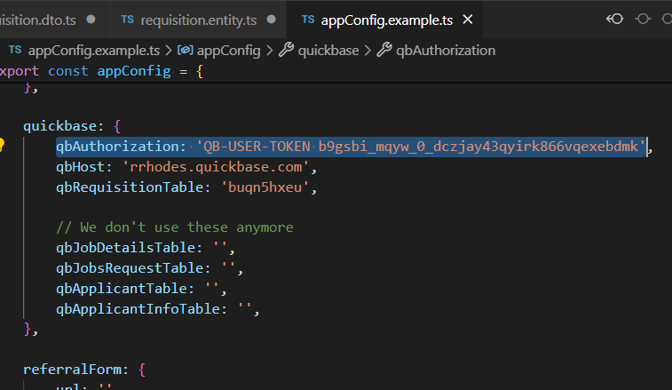
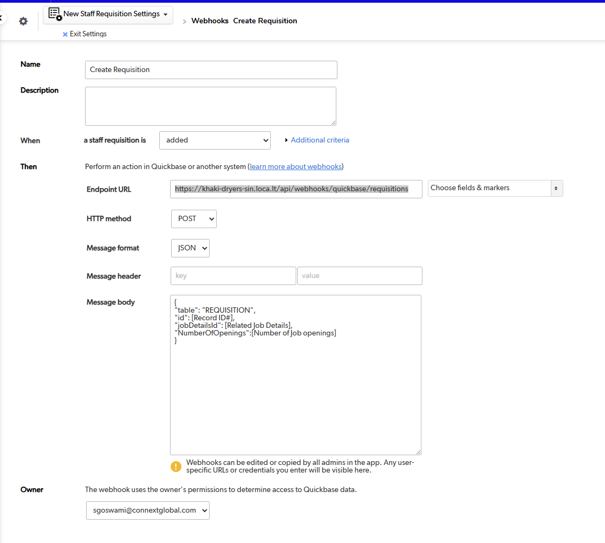
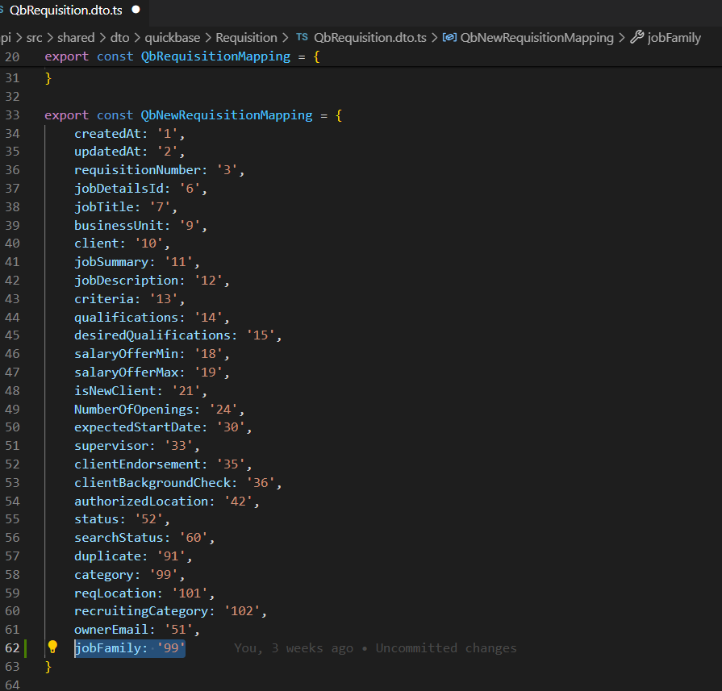
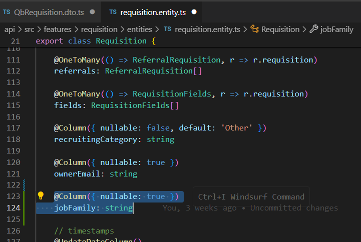

# Quickbase Integration

:::danger
Notice we are still using my user token for this. If for some reason they decide to delete my qb account, this token might not work anymore.



Kindly request a new account to be created for accessing the dev test and just create a new user token.
:::


:::warning
If our server experiences downtime, we need to manually run the following command:

```
npm run cli:run -- command=populate-requisitions-from-qb
```

This is necessary because the webhooks will be down during the downtime and won’t keep the data synchronized.
:::

## Overview

In this section, we’ll document the integration of Quickbase with COT. We’ll explore how to sync the development instance of Quickbase with the local environment. Additionally, we’ll use LocalTunnel to test Quickbase webhooks. We will also see how we can add new fields to sync.

## Get latest data from Quickbase

### 1. Delete all records from requisitions table

```
# Access mysql from our docker instance
mysql -u root -padmin -P3307

#Delete manually
use recruitment;
delete from requisitions;
```

### 2. Run manual sync

```
# Access the Container's CLI
docker exec -it nestjs-dev sh

# Run the Manual Sync Command
npm run cli:run -- command=populate-requisitions-from-qb
```

:::warning
In production, during manual sync, we don’t need to delete records from the requisitions table. We only delete records from our local database to ensure that all data is synced from the Quickbase development instance and this is only .
:::

## Automated Data Sync via Webhooks

### 1. Install localtunnel

```
npm install -g localtunnel
```

### 2. Run localtunnel

```
# The port here is the current port our api is running on
lt --port 3000

# It will log what url we can access our api
your url is: https://khaki-dryers-sin.loca.lt
```

### 3. Access api from localtunnel

We can now try accessing it from our browser first before updating the webhooks settings on Quickbase.

```
# We will access it like this. Notice we append `/api` here
https://khaki-dryers-sin.loca.lt/api
```

:::warning
Page will show a prompt first where you have to enter a tunnel password first. Please read how to get the password

Usually you can get the password here

```
https://loca.lt/mytunnelpassword
```

:::

### 4. Update Quickbooks Webhooks settings

Now that we have our local api exposed to the internet, we can use the url provided by localtunnel to Quickbooks

#### 4.1 Login to Quickbooks

Go to this url https://rrhodes.quickbase.com/ and login

Navigate or click `Copy of C-HRIS-P v2 - DEV` or simply just use this link https://rrhodes.quickbase.com/nav/app/buqn5hxea/action/appoverview

#### 4.2 Update Webhooks settings for `New Staff Requisition`

Now we just need to navigate to `New Staff Requisition > Settings > Webhooks` (Just try to figure out how to navigate this settings should be very straightforward) or Simply just access this link https://rrhodes.quickbase.com/nav/app/buqn5hxea/table/buqn5hxeu/action/WebhookList

:::info
Notice we have 2 webhooks settings here. For when a requisition is created or updated.
:::

Update those settings and use the url provided by localtunnel

It should look something like this:



:::info
Notice how to changed the Endpoint URL and used the url provided by localtunnel

```
[Url Provided by localtunnel]/api/webhooks/quickbase/requisitions
```

:::

#### 4.3 Update Webhooks settings for `Job Bank (AKA Job Details)`

Since New Staff Requisition is related to Job Bank. We also need to update webhook settings for this.

Jujst navigate to `Job Bank > Settings > Webhooks` (Just try to figure out how to navigate this settings should be very straightforward) or Simply just access this link https://rrhodes.quickbase.com/nav/app/buqn5hxea/table/buqn5hxes/action/WebhookList

:::info
We only have 1 webhook settings for this. Just do the same steps we did on New Staff Requisition
:::

#### 4.4 Testing Webhooks

Now that the webhooks are configured, simply create or edit a requisition from the `New Staff Requisition` page or edit the `Job Bank`. After doing so, check your local environment, and the data should automatically update there as well.

## Syncing a New Field to the Requisitions Table

### 1. Navigate to fields page

First we need to navigate to the fields page of New Staff Requisition.
Navigate to `New Staff Requisition > settings > fields` or simply access this link https://rrhodes.quickbase.com/nav/app/buqn5hxea/table/buqn5hxeu/action/listfields

:::info
You should see here all the fields we can sync to our requisitions table. Also notice fields from the Job Details are showing, we can sync that as well.
:::

:::warning
Please do take note of the `Field ID` because that's what we are going to use for mapping
:::

### 2. Update Requisition Mapping

In our codebase just edit this `QbRequisition.dto.ts` and add the field you want to add to the `QbNewRequisitionMapping` Variable.

Should look something like this (For instance we want to add `Job Family`):



:::info
Notice how the value is 99. This is because that's the field ID of Job Family
:::

### 3. Add a new column on Requisitions table

Just add the column using our Model First Migration in typeorm



:::info
Now just simply generate the migration and run it
:::

:::warning
It's very very important that the column name and the name of mapping are exactly the same. Otherwise, it won't populate. Notice how we used `jobFamily` for both
:::

### 4. Run manual sync

Now that we have everything setup for the new field just simply run this command to populate the new field we've added.

```
npm run cli:run -- command=populate-requisitions-from-qb
```

## Conclusion

We have set up the integration of Quickbase with COT, enabling seamless syncing of the Quickbase development instance with the local environment. By using LocalTunnel, we can efficiently test Quickbase webhooks. Additionally, we've covered how to add new fields for synchronization, ensuring that all necessary data is kept up to date across systems.